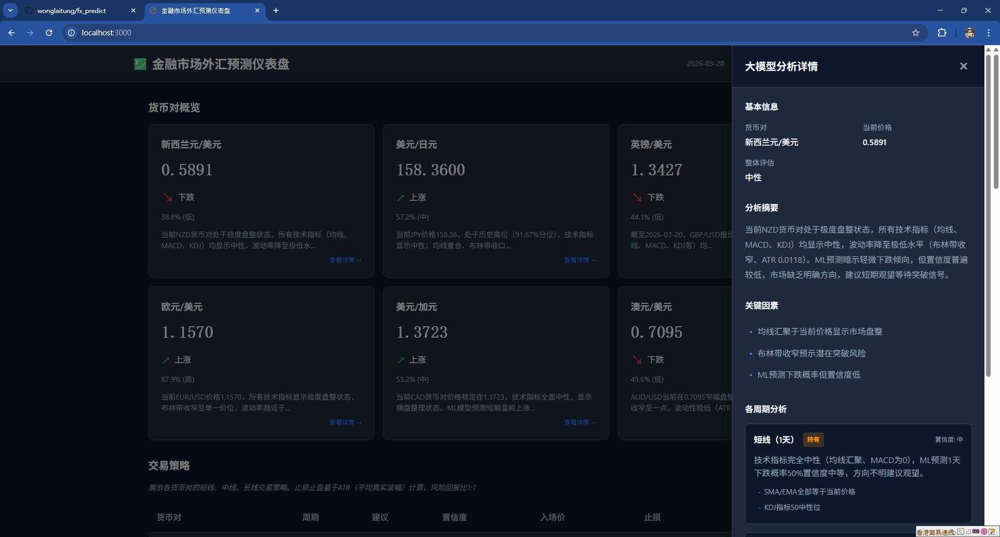
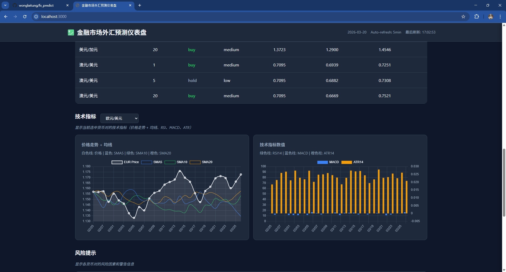

# FX Predict - 外汇智能分析系统

基于机器学习和人机协作的外汇汇率预测系统，整合技术指标分析、CatBoost 预测模型和大模型解释，为外汇交易提供智能化建议。

## 功能特性

### 核心功能

- **双重验证分析系统**：以大模型为核心决策者，整合 35 个技术指标和 ML 预测结果，生成专业自然语言分析报告
- **技术指标引擎**：计算 35 个专业技术指标（趋势、动量、波动、价格形态、市场环境），全部使用滞后数据防止数据泄漏
- **CatBoost 预测模型**：20 天周期预测汇率涨跌方向，支持多货币对独立建模
- **大模型集成**：通义千问 API，提供技术面深度分析、ML 预测验证、风险分析和交易建议
- **灵活报告长度**：支持 Short（50-100字）、Medium（200-300字）、Long（500+字）三种分析报告类型

### 安全保障

- **风险控制**：硬性约束（概率阈值≤0.50禁止买入、≥0.60高概率推荐）、止损止盈机制（基于 ATR）
- **数据泄漏防范**：所有指标使用滞后数据，确保预测有效性
- **置信度分级**：高（≥0.60）、中（0.50-0.60）、低（<0.50）三级置信度评估

## 界面展示

系统提供 Web Dashboard 可视化界面，实时展示货币对概览、交易策略、技术指标和风险分析。

### 主界面



Dashboard 主界面展示所有货币对的实时汇率、预测方向和置信度。点击任意货币对卡片可查看详细的大模型分析报告。

### 技术指标与交易策略



技术指标图表展示价格走势、均线系统和技术指标数值。交易策略表格提供各周期的入场价、止损、止盈建议。

## 人机协作分析流程

系统采用**双重验证分析机制**，以大模型为核心决策者，整合完整的技术指标数据和ML预测结果，生成自然语言格式的市场分析报告和交易建议。

### 工作流程

```
技术指标数据（35个） → LLM 定性分析
                      ↓
ML 预测结果 → LLM 双重验证 → 生成综合建议 + 完整分析报告
                      ↓
              自然语言输出
```

### 分析流程

1. **数据准备**：提取所有技术指标的当前值（35个专业指标）
2. **上下文构建**：整合技术指标、ML预测结果、当前价格等信息
3. **大模型分析**：
   - 技术面深度分析（趋势、支撑阻力、反转信号）
   - ML预测验证（一致性评估、可靠性判断）
   - 风险分析（风险因素、止损建议）
   - 交易建议（明确方向、入场/止损/止盈价格、仓位管理）
4. **输出解析**：提取建议方向、置信度、完整分析报告、关键因素

### 分析报告类型

支持三种长度的分析报告，适应不同场景需求：

- **Short（50-100字）**：简短建议和关键理由
- **Medium（200-300字）**：技术面分析、风险提示、交易建议
- **Long（500+字）**：完整市场分析报告，包含：
  - 技术面深度分析
  - ML预测验证
  - 风险分析
  - 交易建议（入场价、止损位、止盈位、仓位管理）
  - 关键因素总结（3-5个）

### 决策优先级

系统优先使用**LLM建议**作为最终决策，ML预测作为验证参考。当LLM不可用时，降级到基于ML预测的规则引擎。

### 输出内容

每个货币对的分析输出包括：

- **基本信息**：当前价格、分析日期
- **ML预测**：预测方向（上涨/下跌）、预测概率、置信度
- **LLM建议**：建议方向（buy/sell/hold）、置信度、一致性（vs ML预测）
- **完整分析报告**：自然语言格式的专业市场分析
- **关键因素**：影响决策的3-5个核心因素
- **交易执行**：入场价、止损位、止盈位、风险回报比

## 支持的货币对

- EUR/USD（欧元/美元）
- USD/JPY（美元/日元）
- AUD/USD（澳元/美元）
- GBP/USD（英镑/美元）
- USD/CAD（美元/加元）
- NZD/USD（新西兰元/美元）

## 快速开始

### 极简使用方法

最快 3 步启动 Dashboard：

```bash
# 1. 安装依赖
pip install -r requirements.txt

# 2. 配置API密钥并运行完整流程
cp .env.example .env
# 编辑 .env 文件，填入 QWEN_API_KEY
./run_full_pipeline.sh

# 3. 启动 Dashboard
cd dashboard && npm install && npm start
```

访问 `http://localhost:3000` 查看实时外汇预测仪表盘。

### 详细步骤说明

#### 1. 安装依赖

```bash
pip install -r requirements.txt
```

#### 2. 配置环境变量

复制 `.env.example` 为 `.env` 并填入通义千问 API 密钥：

```bash
cp .env.example .env
# 编辑 .env 文件，填入 QWEN_API_KEY
```

#### 3. 准备数据

数据文件 `FXRate_20260320.xlsx` 需要满足以下要求：
- 工作表名称为货币对代码（如 EUR、JPY）
- 包含 `Date` 和 `Close` 列
- 日期格式：MM/DD/YYYY

如需使用其他数据文件，可通过命令行参数指定：`./run_full_pipeline.sh --data-file XXX.xlsx`

#### 4. 运行完整流程（生成预测数据）

```bash
# 运行完整流程（训练 + 预测 + 分析）
./run_full_pipeline.sh

# 跳过训练，只进行预测和分析（模型已存在时）
./run_full_pipeline.sh --skip-training

# 禁用大模型分析
./run_full_pipeline.sh --no-llm
```

此步骤会生成所有货币对的多周期预测数据（JSON格式），保存到 `data/predictions/` 目录。

#### 5. 启动 Dashboard

```bash
cd dashboard
npm install
npm start
```

访问 `http://localhost:3000` 查看 Dashboard。

Dashboard 功能：
- 实时显示货币对概览卡片（价格、预测、概率、置信度、分析摘要）
- 交易策略表格（各周期入场价、止损、止盈、建议、置信度）
- 技术指标图表（价格走势 + 均线、技术指标数值）
- 风险提示面板
- 点击卡片查看完整大模型分析（侧边栏详情）

### 单独运行各模块

```bash
# 训练单个货币对的所有周期模型
python3 -m ml_services.fx_trading_model --mode train --pair EUR

# 生成单个货币对的多周期预测
python3 -m ml_services.fx_trading_model --mode predict --pair EUR

# 综合分析单个货币对
python3 -m comprehensive_analysis --pair EUR
```

### 使用方法对比

| 使用场景 | 极简使用方法 | 详细步骤说明 |
|---------|------------|------------|
| 适合人群 | 想要快速查看 Dashboard 效果的用户 | 需要自定义配置的开发者 |
| 配置复杂度 | 低（使用默认配置） | 高（可自定义各项参数） |
| 配置项 | 仅需配置 API 密钥 | 数据文件路径、模型参数等 |
| 灵活性 | 低 | 高 |
| 适用场合 | 快速体验、功能演示 | 生产环境部署、深入调试 |
| 了解系统原理 | 不需要 | 需要 |

## 测试

```bash
# 运行所有测试
pytest tests/ -v

# 运行特定测试文件
pytest tests/test_integration.py -v

# 运行测试并检查覆盖率
pytest tests/ --cov=. --cov-report=html --cov-report=term
```

**测试覆盖率**: 85%（103个测试用例）
- 总测试数：103个
- 单元测试：94个
- 集成测试：9个

## 技术指标（35个）

所有指标均使用滞后数据（`.shift(1)`）防止数据泄漏：

### 趋势类（11个）
- SMA/EMA（5/10/12/20/26/50/120日）
- MACD、MACD_Signal、MACD_Hist
- ADX、DI_Plus、DI_Minus

### 动量类（7个）
- RSI14、K、D、J、WilliamsR_14、CCI20

### 波动类（6个）
- ATR14、布林带、Std_20d、Volatility_20d

### 成交量类（1个）
- OBV（能量潮）

### 价格形态类（5个）
- Price_Percentile_120、Bias（5/10/20）、Trend_Slope_20

### 市场环境类（2个）
- MA_Alignment

### 交叉特征（2个）
- SMA5_cross_SMA20：均线交叉信号（金叉/死叉）
- Price_vs_Bollinger：价格在布林带中的位置

## 数据流设计

```
┌─────────────────────────────────────────────────────────────┐
│                    数据流（双重验证）                        │
├─────────────────────────────────────────────────────────────┤
│                                                             │
│  Excel 数据                                                 │
│       │                                                     │
│       ▼                                                     │
│  ┌─────────────────┐                                        │
│  │ 技术指标引擎    │──→ 35个技术指标                       │
│  └────────┬────────┘                                        │
│           │                                                 │
│           ├──────────────┐                                  │
│           ▼              ▼                                  │
│  ┌──────────┐    ┌──────────┐                              │
│  │指标数据   │    │ ML 模型   │                              │
│  └────┬─────┘    └────┬─────┘                              │
│       │               │                                     │
│       └───────┬───────┘                                     │
│               ▼                                             │
│        ┌─────────────┐                                     │
│        │  构建上下文  │                                     │
│        │  - 完整指标  │                                     │
│        │  - ML 预测   │                                     │
│        └──────┬──────┘                                     │
│               ▼                                             │
│        ┌─────────────┐                                     │
│        │  大模型分析  │                                     │
│        │  - 定性分析  │                                     │
│        │  - 双重验证  │                                     │
│        └──────┬──────┘                                     │
│               ▼                                             │
│        ┌─────────────┐                                     │
│        │  解析输出    │                                     │
│        │  - 建议      │                                     │
│        │  - 置信度    │                                     │
│        │  - 分析报告  │                                     │
│        └──────┬──────┘                                     │
│               ▼                                             │
│  ┌──────────────────────────────────┐                      │
│  │  综合输出                         │                      │
│  │  - LLM 建议（优先）              │                      │
│  │  - 完整分析报告（自然语言）      │                      │
│  │  - 入场/止损/止盈价格           │                      │
│  └──────────────────────────────────┘                      │
│                                                             │
└─────────────────────────────────────────────────────────────┘
```

## 项目结构

```
fx_predict/
├── run_full_pipeline.sh          # 一体化脚本（推荐）
├── data/                           # 数据目录
│   ├── models/                    # 训练好的模型（CatBoost）
│   └── predictions/               # 预测结果
├── data_services/                 # 数据服务层
│   ├── excel_loader.py           # Excel 数据加载器
│   └── technical_analysis.py     # 技术指标引擎（35个指标）
├── ml_services/                   # 机器学习服务层
│   ├── fx_trading_model.py       # CatBoost 模型
│   ├── feature_engineering.py    # 特征工程（18个特征）
│   └── base_model_processor.py   # 模型处理器
├── llm_services/                  # 大模型服务层
│   └── qwen_engine.py            # 通义千问 API 封装
├── comprehensive_analysis.py      # 人机协作整合层（双重验证）
├── config.py                      # 配置文件
├── requirements.txt               # 依赖列表
└── tests/                         # 测试文件（103个测试用例）
    ├── test_integration.py       # 集成测试
    ├── test_comprehensive_analysis.py
    ├── test_excel_loader.py
    ├── test_feature_engineering.py
    ├── test_fx_trading_model.py
    └── test_technical_analysis.py
```

## 风险控制

### 硬性约束

1. **绝对禁止买入**：当 CatBoost 预测概率 ≤ 0.50 时，禁止买入
2. **高概率推荐**：当概率 ≥ 0.60 且预测为上涨时，推荐买入
3. **止损止盈**：基于 ATR 计算（2倍 ATR）

### 置信度分级

- 高：probability ≥ 0.60
- 中：0.50 ≤ probability < 0.60
- 低：probability < 0.50

## 数据文件格式

Excel 文件必须满足：
- 工作表名称为货币对代码（如 EUR、JPY）
- 包含 `Date` 和 `Close` 列
- 可选：`High`、`Low`、`Open` 列（系统会自动生成）
- 日期格式：MM/DD/YYYY

## 常见问题

### 模型训练失败
- 确保数据点充足（至少 100 条）
- 检查数据文件格式和必需列
- 查看日志输出了解具体错误

### 大模型不可用
- 如果未配置 `QWEN_API_KEY`，大模型功能不可用
- 不影响核心功能（ML 预测和技术分析）

## 技术栈

- **Python**: 3.10+
- **机器学习**: CatBoost
- **数据处理**: Pandas, NumPy
- **大模型**: 通义千问 API

## 开发者

- **版本**: 1.0 (MVP)
- **创建时间**: 2026-03-25

## 许可证

本项目仅供学习和研究使用。